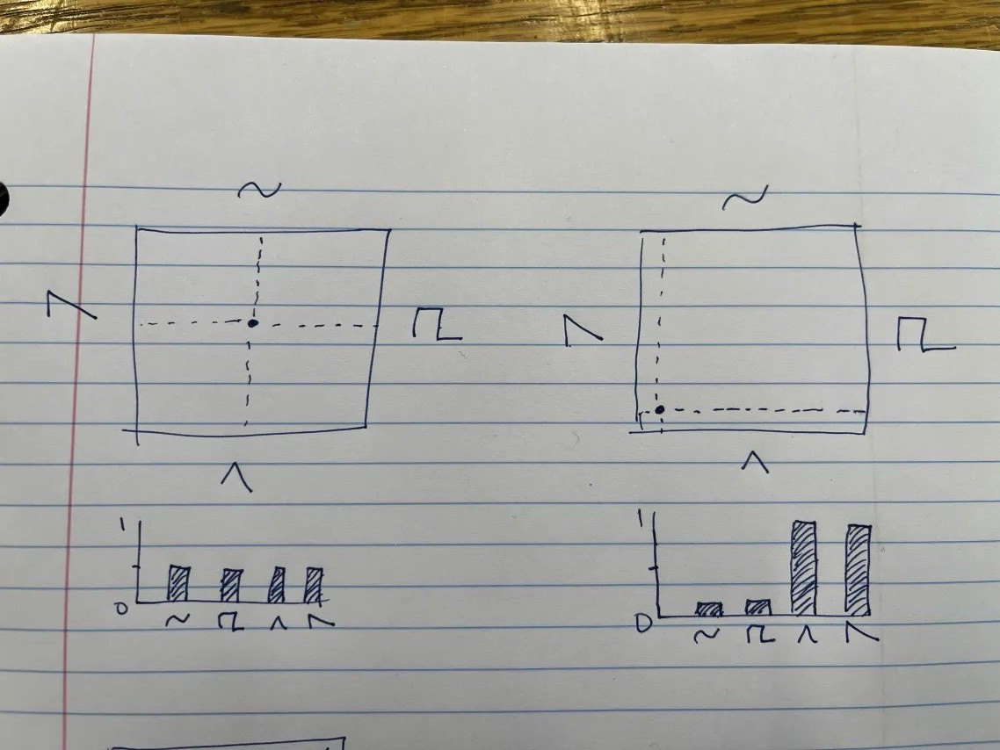
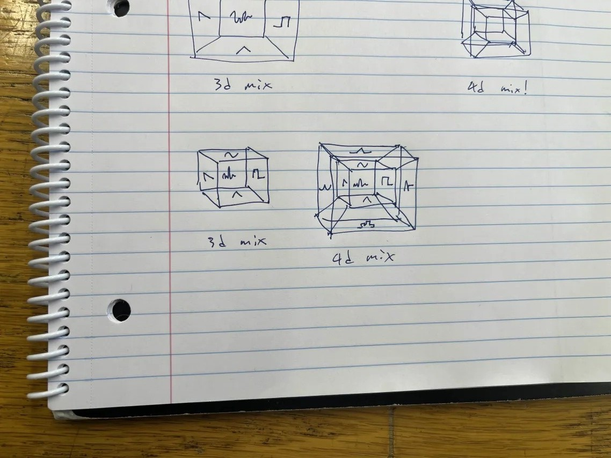
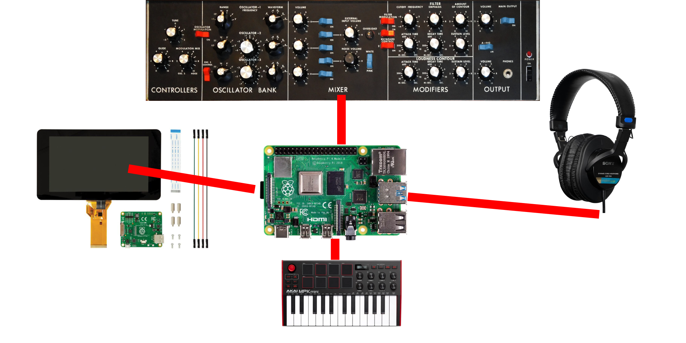

## Idea
My project is a wavetable synthesizer that visually represents the mixing of different waveforms.
The user is given a geometric shape. Each face of the shape represents a waveform.
The position of the “cursor” adjusts the amplitude of each wave in the mix.
The distance between the cursor and face determines the gain.

    <figure>
        
         
        <figcaption>Fig 1. Two examples of 2D mixers</figcaption>
    </figure>

    <figure>
        
         
        <figcaption>Fig 2. extending the concept to higher dimensions (cube and tesseract)</figcaption>
    </figure>

## Technical details
I plan to write the code using the libsoundio library.
I will use the C3 language, which has C ABI to allow use of the library.
## Method
I will use an approach I found on wikipedia: iterating through arrays containing waveforms at a given speed, and using linear interpolation to fill in the gaps.
I already have a repo up with a working example (440hz sine wave)
## Hardware
If time permits, I want to have a hardware interface. 
I will use a Raspberry Pi and read from plate-mounted potentiometers and buttons.
I also want midi input. If I have time I want to integrate a keyboard into the device itself, kind of like the Minimoog.
I will also have a display to show the position of the cursor within the shape.
To simplify the design, I will use the builtin HDMI and audio jack.

    <figure>
        
         
        <figcaption>Fig 3. Architecture</figcaption>
    </figure>

    <figure>
        
         
        <figcaption>Fig 4. Final enclosure design example (mine will be smaller)</figcaption>
    </figure>

## References
The original idea came from Ewan Bristol’s Plugdata sketch
I expanded on it by making it 3d and having hardware
Fig 3. The front panel is from the Moog Minimoog
Fig 3. The headphones are the Sony MDR-7506
Fig 4. This is the Waldorf Music “MK2”
